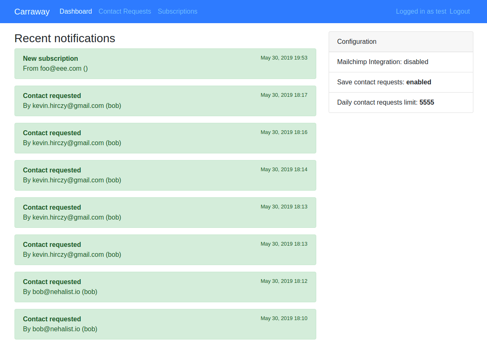

# Carraway

> **No longer maintained**.

[](https://travis-ci.org/nehalist/carraway)

A static-site helper which provides an API for contact form submissions and
subscriptions.



### But why?

Static sites (e.g. Gatsby or Jekyll) are awesome - but there are limitations.
Having a contact form or managing subscriptions is part of these limitations -
without a proper API you can't just have these things.

There are solutions out there for contact form submissions and there are
solutions out there for subscription management. I don't like to have many
different services to maintain [one single blog](https://nehalist.io). It's just
a blog.

Most of them either cost way too much for smaller projects (like a blog) or
aren't working properly.

Additionally relying on third party services always mean giving data away.

Or maybe I'm just really bad at using Google and had
too much time on my day off.

## Features

- Admin UI with multi user login
- Contact form submission API
- Subscription API
- Mailchimp Integration which automatically syncs subscriptions

## Requirements

- PHP 7.1.3 or higher
- SQLite

## Installation

> For webserver configuration of Symfony applications see the official
  [Configuring a Web Server](https://symfony.com/doc/current/setup/web_server_configuration.html) guide.

1. Clone the repository `git clone https://github.com/nehalist/carraway.git`
2. `cd` into the repo directory
3. Install dependencies with `composer install --no-dev --optimize-autoloader`
4. Create the database with `bin/console doctrine:database:create`
5. Execute migrations with `bin/console doctrine:migrations:migrate`
6. Create a user with `bin/console app:create-user <name> <password>`
7. Copy and rename your `.env` file to `.env.local` and adjust its values
(see below for dotenv file details)
8. Clear your cache with `APP_ENV=prod APP_DEBUG=0 php bin/console cache:clear`

Your admin is accessible at `yourdomain.tld/admin`

## API

Carraway currently provides two different APIs: one for contact form
submissions and one for subscriptions.

### Contact Form Submission

Creates (and optionally saves, depending on `SAVE_CONTACT_REQUESTS` in your
dotenv configuration) contact requests.

```
POST <carraway>/api/contact

Request
{
    name: string;
    mail: string;
    subject?: string;
    message: string;
}

Response
{
    name: string;
    mail: string;
    subject: string;
    message: string;
}
```

### Subscriptions

```
POST <carraway>/api/subscription

Request
{
    name?: string;
    mail: string;
}

Response
{
    name: string;
    mail: string;
}
```

### Errors

Errors do have proper status codes (4xx). API errors always are JSON formatted
with an array of all errors, e.g.:

```json
{
  "errors": [
    "Email already subscribed"
  ]
}
```

System errors (5xx) are also formatted the same way. Their content depend on the
environment; while in `dev` proper exception messages are returned errors in
`prod` only return

```json
{
  "errors": ["System Error"]
}
```

The status code for reached API limits is `429`.

### `fetch` example

An example on how to interact with the API with `fetch`:

```javascript
fetch(`<carraway>/api/contact`, {
  method: `post`,
  headers: {
    'Content-Type': 'application/json'
  },
  body: JSON.stringify({
    name: 'John Doe',
    mail: 'john@doe.com',
    message: 'Howdy!'
  })
})
  .then(res => res.json())
  .then(res => console.log(res));
```

## Dotenv file

App configuration is entirely done via `.env` (respectively `.env.local`) files.

| value | description |
|-------|-------------|
| `CONTACT_REQUEST_FROM` | Sender mail for contact form submissions |
| `CONTACT_REQUEST_TO` | Receiver mail for contact form submissions |
| `MAILCHIMP_API_KEY` | Your [Mailchimp API Key](https://mailchimp.com/help/about-api-keys/) |
| `MAILCHIMP_API_URL` | Your [Mailchimp API URL](https://developer.mailchimp.com/documentation/mailchimp/guides/get-started-with-mailchimp-api-3/) |
| `MAILCHIMP_LIST_ID` | Your [Mailchimp List ID](https://mailchimp.com/help/find-audience-id/) where subscribers should be added / deleted |
| `SAVE_CONTACT_REQUESTS` | If contact requests should be saved (hi @ GDPR) |
| `DAILY_CONTACT_REQUESTS_LIMIT_PER_IP` | Maximum contact requests from one ip for one day |

> __Important__: __NEVER__ change the `.env` file directly. Always create a
copy from it (`.env.local`) and change this file!

## Author & License

Created by [nehalist.io](https://nehalist.io) - Released under
the [MIT license](LICENSE).
